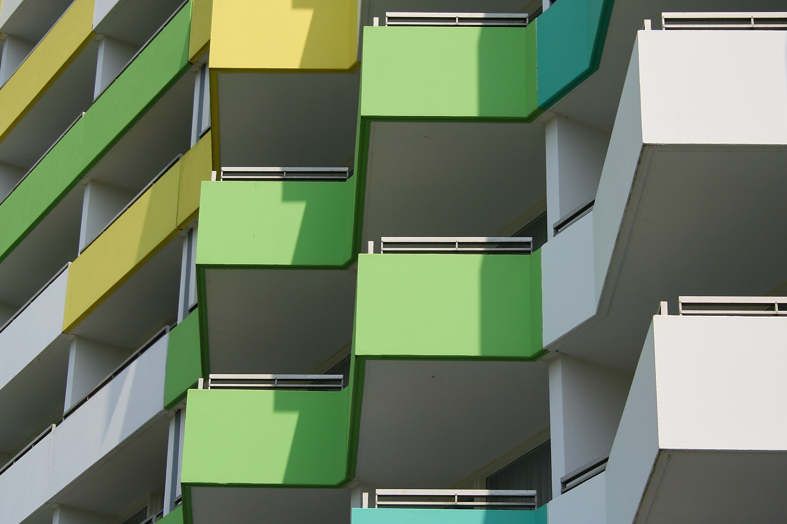

# Fassade - Schutz des Gebäudes dank optimaler Fassade
Fassaden sind die Aussenhaut von Gebäuden. In dieser Funktion sind sie intensiven Wetter- und Umweltbedingungen ausgesetzt. Der beste Schutz vor diesen Belastungen ist eine gut erhaltene verputzte Aussenwärmedämmung. Diese Fassadenisolation schützt das Gebäude zudem vor Wärmeverlust, wodurch grosse Einsparungen bei den Heizkosten gemacht werden können. Dafür dankt auch die Umwelt.
Wir isolieren und verputzen Fassaden, aber auch Keller und Estriche. Durch die langjährige Erfahrung unserer Mitarbeitenden und die persönlichen Beratungsgespräche erhält jedes Objekt eine möglichst ideale Fassadenisolation: egal ob bei einem Neubau oder einer energetischen Sanierung der Gebäudehülle.
Für die Erstellung oder Sanierung der Fassade verwenden unsere Isoleure Polystyrol- oder Mineralwolldämmplatten sowie Putzbeschichtungen. Diese Materialien ermöglichen eine grosse gestalterische Varietät. Gestalterische Visionen werden durch verputze Aussenwärmedämmungen in Verbindung mit ökologischen Denkansätzen gebracht.

### Wir sanieren Fassaden mit Leidenschaft
Unser Angebot geht im Fassadenbau weit über Neubauten heraus: 
Wir sind die Profis im Renovieren und Sanieren von Fassaden. Das Spektrum reicht dabei von Fassadenreinigungen und Neuanstrichen über aufwändigere Fassadensanierungen wie die Aufdoppelung von Isolation bis hin zum Entfernen und Neuanbringen von Dämmungen oder Bekleidungen. 
Unser Angebot
- Professionelle Beratung zu verputzten Aussenwärmedämmungen
- Professionelle Beratung zu Fassadensanierungen
- Langjährige Erfahrung im Dämmen, Isolieren und Verputzen von Fassaden, Kellern und Estrichen
- Optisch nur geringe Veränderungen an der Aussenhülle
- Geringere Heizkosten sowie Schutz der Umwelt durch optimale Wärmedämmung
- Detaillierte Offerten auf Anfrage
