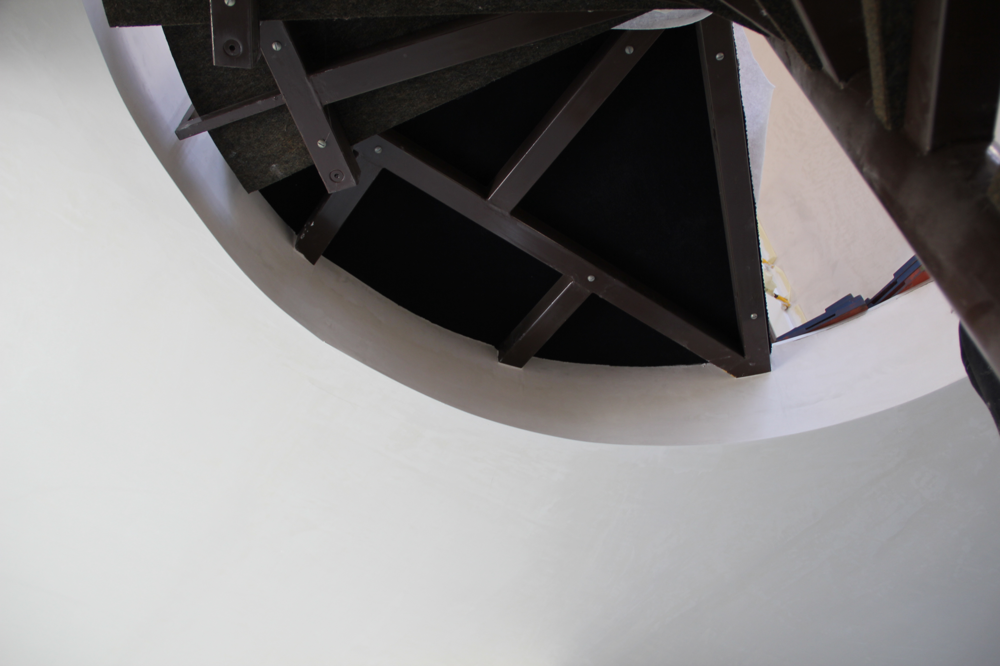

 

 

  <ol class="carousel-indicators">
    <li data-target="#carouselExampleIndicators" data-slide-to="0" class="active"></li>
    <li data-target="#carouselExampleIndicators" data-slide-to="1"></li>
    <li data-target="#carouselExampleIndicators" data-slide-to="2"></li>
	<li data-target="#carouselExampleIndicators" data-slide-to="3"></li>
  <li data-target="#carouselExampleIndicators" data-slide-to="4"></li>
  
  </ol>
  

  
  

    
  

  

    
  

  

    
  

  
  

    
  

  
  

    
  

  

  <a class="carousel-control-prev" href="#carouselExampleIndicators" role="button" data-slide="prev">
    
    Previous
  </a>
  <a class="carousel-control-next" href="#carouselExampleIndicators" role="button" data-slide="next">
    
    Next
  </a>

 

# Qualität hat einen Namen
Unser Gipsergeschäft in Emmenbrücke im Kanton Luzern wurde im Jahr 2008 von Mentor Galli gegründet. Wir verfügen über mehrjährige Erfahrung als Gipser und üben diesen Beruf mit Leidenschaft aus. Wir legen Wert auf eine gute Ausbildung unserer Mitarbeiter. Unser Unternehmen hat sich auf alle Gipsarbeiten, Trockenbau und Fassadenarbeiten spezialisiert. Mit dem nötigen Know How , modernster Technik und unseren hochwertigen Materialen erreichen wir ein einwandfreies Ergebnis bei dem auch der Preis stimmt. Zu unseren Kunden gehören Baufirmen, Architekten sowie Private Bauherren. 

### Bauen auch Sie gerade?

Zögern Sie nicht und fordern Sie noch heute kostenlos und unverbindlich eine Offerte an.