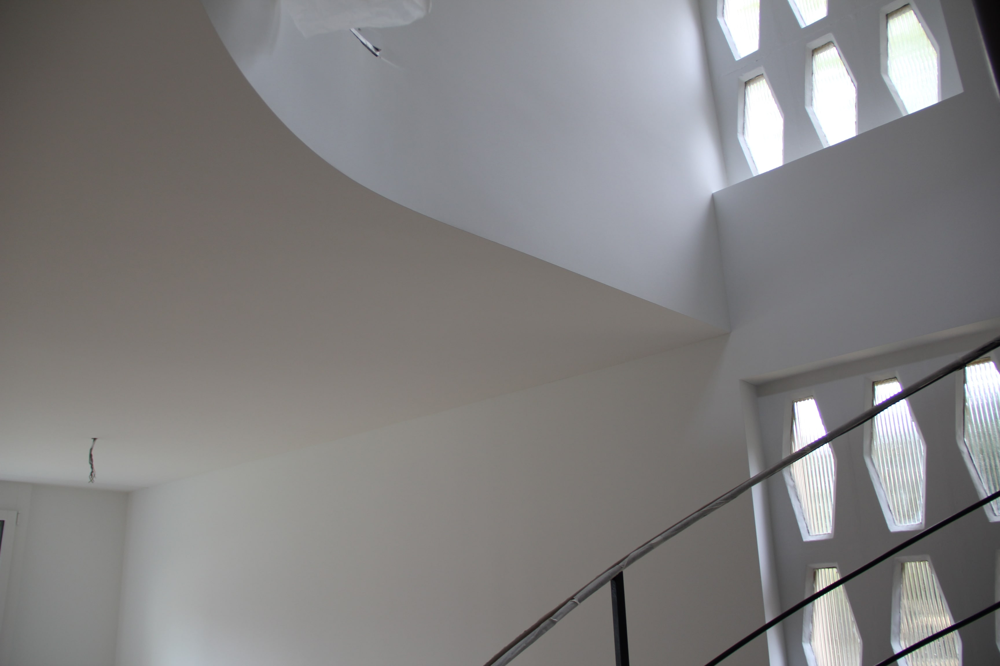

# Kreative Vielfalt beim Verputzen

Unsere Gipser sind die Meister im Verputzen und Gestalten von Wänden nach den individuellen Wünschen der Kunden. Zu unterscheiden sind dabei Grund- und Deckputze. Der Grundputz wird auf rohe, betonierte oder gemauerte Wände aufgezogen und schafft so eine glatte Zwischenschicht. Auf diese erste Schicht trägt der Gipser im Normalfall einen Deckputz auf – entweder ein Glattstrich, auch bekannt als Weissputz, oder ein Abrieb aus Sand und Bindemittel.
Bei diesen Abrieben präsentieren sich den Kunden zahlreiche Varianten, die je nach ästhetischen Vorlieben eingesetzt werden. Die Körnungen sind fein oder grob erhältlich. Die Oberflächenstruktur wird durch die Verwendung des Werkzeugs und die Art des Aufziehens verändert. Sie kann beispielsweise gerieben, geworfen oder poliert sein. Je nach Zusammensetzung des Putzes entsteht ein anderer Effekt an der Wand.

- Mineral-Fertigputz:	Auch genannt organischer Silikat-Putz. Dieser Putz ohne Kunststoffzusätze wird verarbeitungsfertig angeboten und besteht aus weissem Marmormehl. Er kann in den gewünschten Farben abgetönt werden, benötigt jedoch einen Endanstrich. 
- Kalkputz:	Der mineralische Putz mit Tradition. Er ist diffusionsoffen, schafft ein angenehmes Raumklima und wirkt durch seine hohe Alkalität desinfizierend.
- Kunstharzputz	Diese Fertigputze gibt es in vielen Körnungen, Strukturvarianten und Farben. Kurz rühren, je nach dem mit Lösemittel oder Wasser ergänzen und auf der gewünschten Wand aufziehen. 
- Lehmputz:	Die natürlichen Lehmputze können glatt, modelliert oder durch Muscheln oder Steine veredelt sein. Die spezifischen Farben wirken positiv auf das Raumklima. Lehmputze sind sehr ökologisch.
- Schlämmputz:	Auch Schlämme genannt. Der Verputz wird aufgetragen und anschliessend mit einer Streichbürste verwaschen. Dieser Putz zeichnet je nach Einsatz die ursprüngliche Oberfläche ab.
- Stucco veneziano:	Die jahrhundertealte Spachteltechnik. Mit einer Mischung aus mineralischem Farbstoff, Kalk und Wachs verputzen unsere Gipser die gewünschte Wand.
 - Magnetputz:	Metallsand im Putz schafft eine Oberfläche, auf der Magnete sicher haften. Ein anschliessender farbiger Anstrich schafft den gewünschten Blickfang.
 - Weissputz:	Auch Glattputz genannt, ist heute sehr im Trend. Er kann leicht ausgebessert werden, und besteht hauptsächlich aus Naturgips und Kalkhydrat. Gips ist umweltfreundlich, atmungsaktiv und feuchtigkeitsregulierend. Weissputz ist auch für den Nassbereich auf Zementbasis erhältlich.

Unser Angebot
- Individuelle Beratung zu den verschiedenen Innen- und Aussenputzen
- Saubere und sorgfältige Ausführung durch unsere Gipser
- Detaillierte Offerten auf Anfrage

