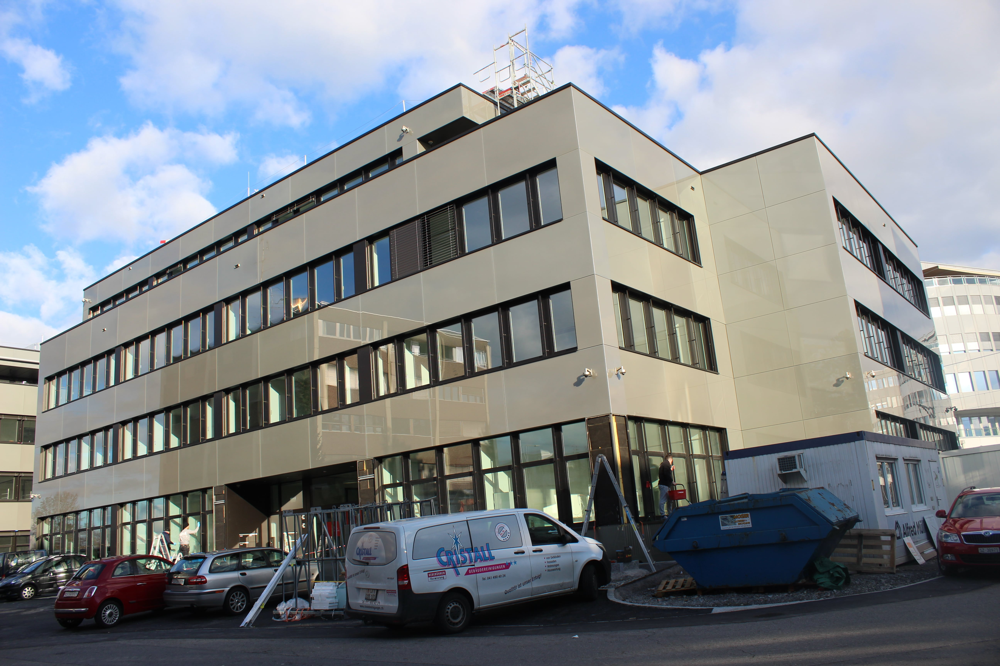
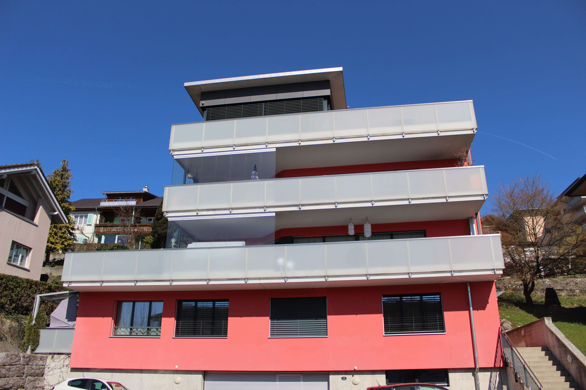

# Referenzen

### Geschäftshaus E.G.O (Steinhausen)

### Geschäftshaus Biogen (Baar)

### Mehrfamilienhaus (Emmenbrücke)

### Mehrfamilienhaus (Eschenbach Luzern)

### Reiheneinfamilienhaus (Stadt Luzern)

### Mehrfamilienhaus (Rothenburg)

### Geschäftshaus Nordstream (Steinhausen)

