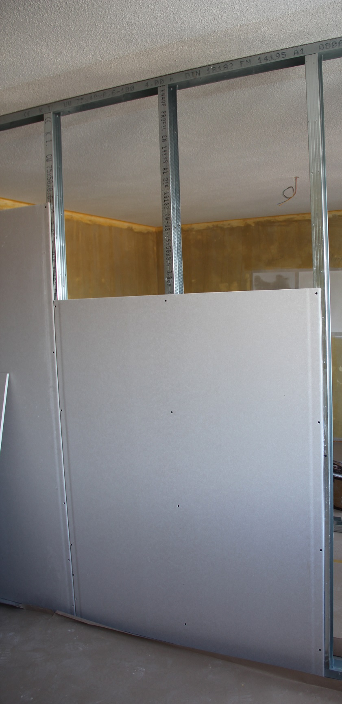

# Trocken- und Leichtbauarbeiten
### Raumgestaltung durch Gipsplatten

Ob Neubau, Haussanierungen, Dachausbau oder Umbau – der Trockenbau bietet für verschiedenste Arten von Bauvorhaben praxiserprobte Systeme. Unsere Gipser ziehen für unsere Kunden Trennwände ein, installieren abgehängte Decken oder bauen den Estrich zum Wohnbereich um.
Auf Unterkonstruktionen aus Latten, Kanthölzern oder Metallprofilen werden vorgefertigte Gipsplatten montiert. Die Hohlräume zwischen der Konstruktion werden mit Dämmstoff isoliert. Diese Räume ermöglichen zudem das einfache Verlegen von Installationsleitungen für Strom und Wasser. Durch das Verspachteln der Gipsplatten mit einer Spachtelmasse entsteht der perfekte Untergrund für einen Deckputz oder den Maler.
Im Vergleich zu massiven Mauern aus Steinen wird im Trockenbau die Feuchtigkeit aus den Innenräumen ferngehalten. Dadurch kann Zeit für die Trocknung gespart werden, das Bauvorhaben ist rascher umgesetzt. Weitere Vorteile liegen im flexiblen, schnellen Auf- resp. Rückbau von Trennwänden oder abgehängten Decken sowie in der Möglichkeit der freien Raumgestaltung.
Wir arbeiten mit hochwertigen Produkten von der Knauf AG sowie der Rigips AG und führen die Arbeiten System- und Fachgerecht aus.

Vorteile der Leichtbauweise
- Gute Schalldämmung
- Flexible Raumeinteilung
- Einfach wieder entfernbar
- Gute Brandbeständigkeit
- Brandschutz und Schallschutz
- Raumakustik
- Raumgestaltung

Unser Angebot
- Individuelle Beratung zum Trockenbau
- Ausführung durch ausgebildete Gipser
- Detaillierte Offerten auf Anfrage

